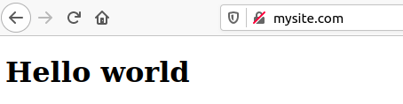
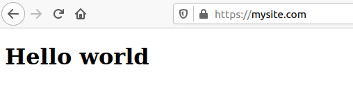

# Arhitecture


# NGINX with HTTP
Nginx is a web server sofware
```
sudo apt install nginx
sudo systemctl enable nginx
sudo systemctl start nginx
```
To check the status of the nginx daemon
```
sudo systemctl status nginx
```
On host machine (here linux), associate a domain name to IPv4 of the vm
```
echo "192.168.1.X mysite.com" >> /etc/hosts
```
Access to the web service through web navigator
```
http://mysite.com
```
The default web page is defined in the file
```
ls -lrt /var/www/html/
```
Create a new index.html with the following content
```
rm -f /var/www/html/index*.html
vi /var/www/html/index.html
```
```
<!DOCTYPE html>
<html>
    <head>
        <title>Welcome to nginx!</title>
    </head>
    <body>
        <h1>Hello world</h1>
    </body>
</html>

```
Refresh the web navigator to see the modification effect.



This web page is not secured. It means that information exchange between your web navigator and web server is not encrypted.
For example, credit card number sent to http web server can be captured and read by hacker
# Certificates

## CA
Certificate Authority is an organisation that certifies that the certificate (public rsa key) provided when using HTTPS protocol correponds to the domain name that user accesses to.
Let's Encrypt, for example is a CA that provide free certificate signing service.
In the on-premise environment, we will have the private CA to do the job.

To create the CA private key:
```
openssl genrsa -des3 -out CA-key.pem 2048
#provide password to protect private key, e.g. capass
```
To generate the CA public certificat:
```
openssl req -new -key CA-key.pem -x509 -days 1000 -out CA-cert.pem
#provide information when asked
#e.g. #capass , FR , Garonne , Toulouse ,PrivateCA , IT ,privateca.com , privateca@privateca.com
```
User will then import this certificat in their trust store to trust any web server certificat signed (approuved) by this private CA.

## Server
Create server private key
```
openssl genrsa  -out server-key.pem 2048
```
Create certificate signing request to be signed by CA
```
openssl req -new -key server-key.pem -out server-cert.csr
#FR , Garonne , Toulouse , MySite , IT , mysite.com , myemail@gmail.com
```

## Signing CSR
CA uses their private key (CA-key.pem) to sign the CSR (server-cert.csr)
```
openssl x509 -req -days 365 -in server-cert.csr -CA CA-cert.pem -CAkey CA-key.pem -CAcreateserial -out server-cert.pem 
```
CA sends back the signed certificate (server-cert.pem) to the requester.

# NGINX with HTTPS
To set up SSL for web server, one would need: server-key.pem and server-cert.pem (signed previously be CA)

```
sudo mkdir /root/ssl
sudo cp server-key.pem /root/ssl/
sudo cp server-cert.pem /root/ssl/
```

Modify the configuration file of nginx
```
sudo vi /etc/nginx/nginx.conf
```

```
#user www-data;
worker_processes auto;
pid /run/nginx.pid;

events {
	worker_connections 768;
	# multi_accept on;
}

http {
       
	##
	# Basic Settings
	##

	sendfile on;
	tcp_nopush on;
	tcp_nodelay on;
	keepalive_timeout 65;
	types_hash_max_size 2048;
	# server_tokens off;

	# server_names_hash_bucket_size 64;
	# server_name_in_redirect off;

	include /etc/nginx/mime.types;
	default_type application/octet-stream;
        
        server {
          listen 443 ssl;
          ssl_certificate /root/ssl/server-cert.pem;
          ssl_certificate_key /root/ssl/server-key.pem;
          server_name mysite.com;
          location / {
            root /var/www/html;
          }
        } 
	##
	# SSL Settings
	##

	ssl_protocols TLSv1 TLSv1.1 TLSv1.2 TLSv1.3; # Dropping SSLv3, ref: POODLE
	ssl_prefer_server_ciphers on;

	##
	# Logging Settings
	##

	access_log /var/log/nginx/access.log;
	error_log /var/log/nginx/error.log;

	##
	# Gzip Settings
	##

	gzip on;

}
```
Reload nginx service:
```
sudo nginx -s reload
```

On premise user will then need to add the CA certificate (CA-cert.pem) to their trust store to access to the web service with HTTPS.

For example, with firefox as web navigator:
```
Preferences > Private & Security > Certificates > View Certificates > Import
```
Access to this URL in firefox navigator
```
https://mysite.com
```

