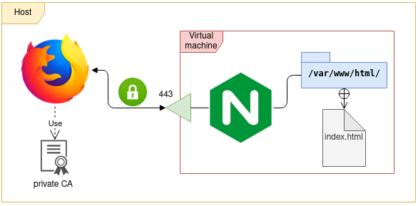

# Arhitecture


# NGINX with HTTP
Nginx is a web server sofware
```
sudo apt install nginx
sudo systemctl enable nginx
sudo systemctl start nginx
```
To check the status of the nginx daemon
```
sudo systemctl status nginx
```
Access to the web service through web navigator
```
http://192.168.1.X
```
The default web page is defined in the file
```
ls -lrt /var/www/html/
```
Create a new index.html with the following content
```
rm -f /var/www/html/index*.html
vi /var/www/html/index.html
```
```
<!DOCTYPE html>
<html>
    <head>
        <title>Welcome to nginx!</title>
    </head>
    <body>
        <h1>Hello world</h1>
    </body>
</html>

```
This web page is not secured. It means that information exchange between your web navigator and web server is not encrypted.
For example, credit card number sent to http web server can be captured and read by hacker
# Certificates

## CA

## Server

## CSR & Signature

# NGINX with HTTPS